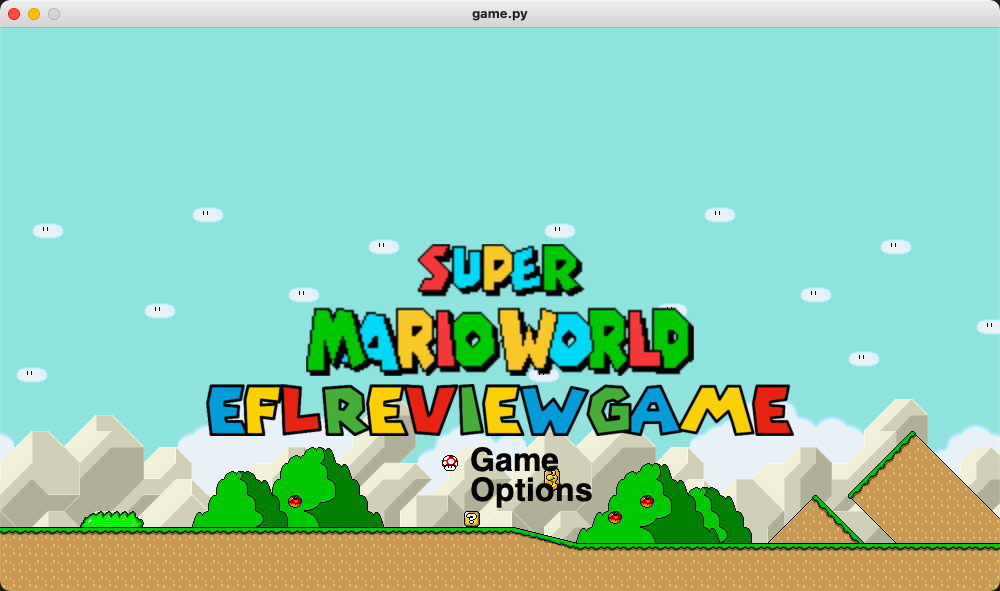
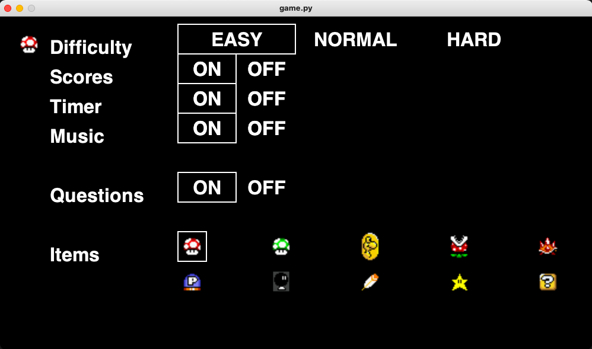
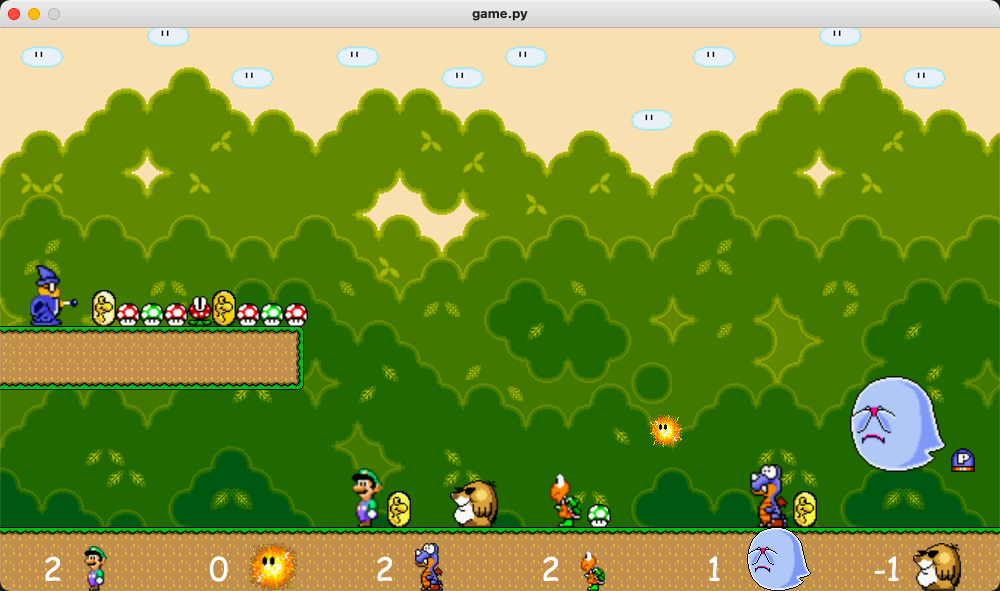
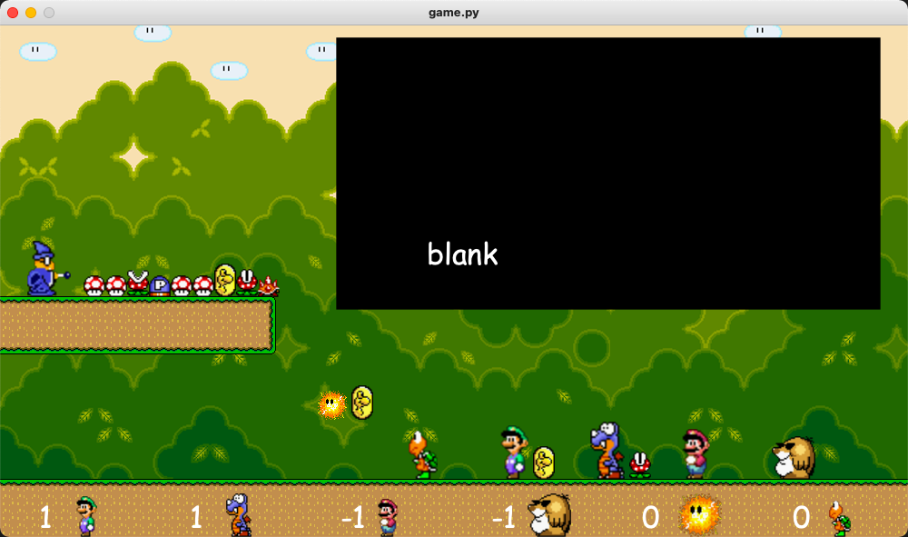

# Mario-Themed English Quiz Game
A turn-based English flashcard review game.  
Up to 6 players.  
Don't forget to install dependencies with `pip install -r requirements.txt` and to start up your virtual environment.  
Tested on python 3.9 and macOS (Big Sur).  

## Operation
Here is a [YouTube video demo](https://youtu.be/DmhNWh03no8). There is no audio in this video, but the actual game has music and sound effects.

1. Create and run virtual environment:  
```bash
python3 -m venv venv
source venv/bin/activate
```  
2. Run `./startGame`  
3. Run tests with `./test`

### Basic Gameplay
1. Decide the order of the teams and let them choose their players.
2. Run the game with `./start`
3. Wait for the players and items to come to a stop.
4. Press 1 to give a player an item.
5. Press "o" for a right answer and "x" for a wrong answer.
5. Answer within the time limit.
6. Player with the most points wins.

### Controls
|Key|Description|
|:---|:---|
|1 | give player an item  
|a | rotate items to left  
|s | randomly mix items  
|d | rotate items to right  
|x | current player minus one point  
|o | current player plus one point  
|u | use item (for player in first position only)  
|left arrow|rotate players left  
|right arrow|rotate players right  
|up arrow|randomly mix players  
|esc|quit the game  

#### Options Menu
|Key|Description|
|:---|:---|
|left right|move left and right
|up down|move up and down
|space|enable or disable (items only)  

### Items
|Item|Description|
|:---|:---|
|yoshi coin||
|red mushroom||
|green mushroom||
|pow button||
|spiney beetle||
|pirahna plant||
|bombomb||

_not yet_  
star  
feather  
question block

### Notes
* Still need to add effects for the items.  
* Character and item z-indices are a little wierd and you can notice it when they move across other sprites.  
* Want to add player selection screen.  
* Add difficutly changes. The labels are there but nothing changes yet in the game. 
* Flow chart created here: https://whimsical.com/mario-quiz-game-UmbMmMaY6MUGTp341ngNJW  
* Adding different text files for the different items. If there is a question/problem you want to associate with an item, then you can add your own text. (ex, gamedata/redmushroomQuestions.txt)

### Screen Shots









### Purpose of This Project
To review material in the Total English book series as well as custom questions/problems the teacher would contribute.

### What I learned
* How to focus my attention on the task at hand given a one month deadline.
* How to learn a piece of software (pyglet) with a deadline in mind.
* I learned about the similarities between Pyglet and Pygame.
* How to make a simple a 2D game
* Basic use of GIMP to create (extract) my own sprites.
* The benefits and drawbacks of using a single module to control the constants for a program.
* How to think more about what the customer needs and less about "just making the program work".
  * I made a successful program, but the target audience (my students) were just not that "in to it" as I had hoped. 
  * It is important to make something with the target audience in mind. Make what they want, not what you think they want if you want to increase the chances of having a successful product.
  * I should have gathered more data about my market before making a product. 
  * The program worked but it "missed the mark."
* The importance of having a flowchart to keep track of the logic as the code grows.
